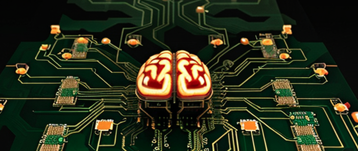

# EEG-ML
EEG Signal Classification with neural networks for BMI Applications

## Introduction

This project uses machine learning techniques to analyze and classify EEG Motor Movement/Imagery Dataset from PhysioNet. This code was initially written as a part of my MSc thesis and later improved while keeping the initial logic and idea the same.

## Use case

EEG classification can be utilized to infer and classify the imagined motor movements thus helping a subject to control a device though a Brain Machine Interface.

## Problem Statement

The EEG Motor Movement/Imagery Dataset is imbalanced, which can lead to a bias in the machine learning model towards the majority class. This project aims to enhance and balance the imbalanced classes using synthetic data upsampling to achieve higher accuracy. The code includes various methods of upsampling and model training and evaluations.

## Dataset

The dataset used in this project is the [EEG Motor Movement/Imagery Dataset](https://physionet.org/content/eegmmidb/1.0.0/) from PhysioNet. It contains EEG data from subjects performing motor/imagery tasks.

## Methodology

1. **Data Preprocessing**: The EEG data is preprocessed to remove noise and make it suitable for the machine learning model.
2. **Synthetic Data Upsampling**: To address the issue of class imbalance, synthetic data upsampling is performed. This helps in balancing the classes and provides more data for the model to learn from.
3. **Model Training**: A machine learning model is trained using TensorFlow. The model is trained on the upsampled dataset.
4. **Model Evaluation**: The performance of the model is evaluated on a separate test set.

## Code Usage

To run the code, follow these steps:

1. Clone the repository.
2. Install the necessary Python packages.
3. Run the main script.

## Results

The use of synthetic data upsampling significantly improved the performance of the machine learning model on the imbalanced EEG Motor Movement/Imagery Dataset.

## Future Work

Future work includes exploring different upsampling techniques and machine learning models to further improve the performance. Currently I'm working on getting things into a better shape including visuals. Docker deployment and a simple showcase jupyter notebook is also on the todo list.
