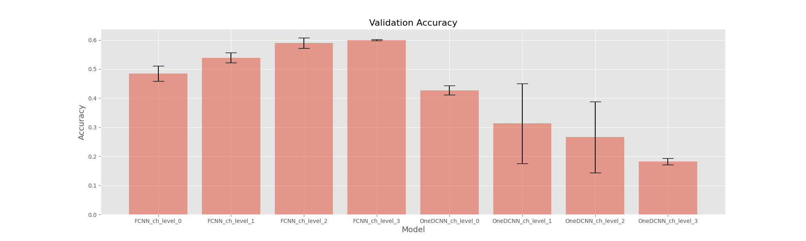
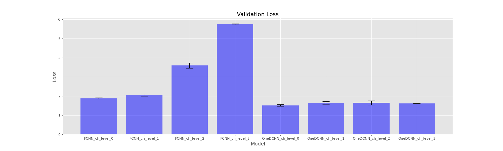

The model performance was evaluated using the following metrics:
- Accuracy
- Precision
- Recall
- F1-score
- ROC curve
- AUC
- Confusion matrix

Additionally every metric was validated using N-fold cross-validation to ensure the model's performance was not overfitting. The results were averaged, graphed and detailed in the results section. The ROC curve was plotted for each model, and the AUC was calculated. The models were then tested on the test set, and the results were compared to the training set to ensure that the model was not overfitting. 

Every respective result can be viewed in the _**Results**_ folder for each model.

The 1-DCNN structure was not sufficient and experienced model collapse multiple times during training.
The Fully Convolutional Neural Network(FCNN) yielded the best results, which were comparable to the literature.

The accuracy increased as the quantity of electrodes increased in the case of the FCNN model. This can be explained by the fact that the more electrodes the model has, the more information it can learn from, which leads to better performance. The 1-DCNN model did not show any improvement in accuracy as the number of electrodes increased. This can be explained by the fact that the 1-DCNN model was not complex enuogh to learn from the additional information.

The loss increased as the size of the model increased. This can be explained by that the more complex model is more prone to overfitting, which led to the model learning more characteristics, and actually got skewed towards the training data.